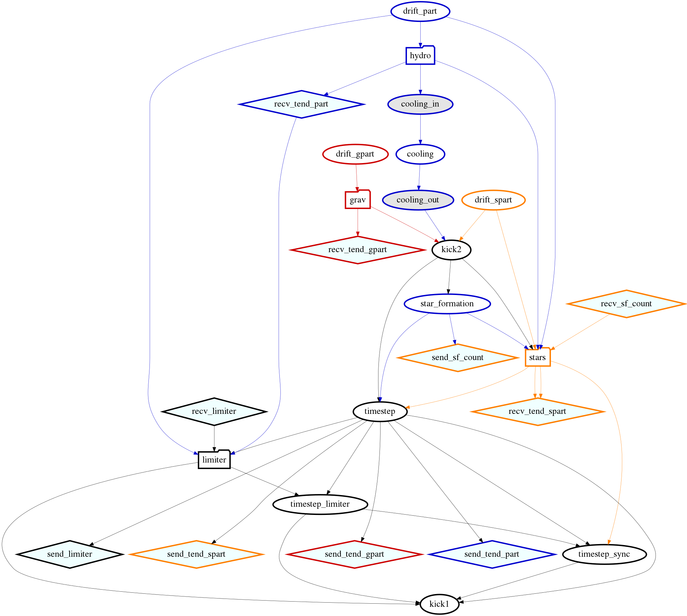

.. Current task dependencies
   Loic Hausammann, 2020

.. _current_dependencies:

Current Task Dependencies
=========================

In order to compute physics in the correct order, SWIFT uses dependencies in between 'tasks' performing different parts of the computation.
In :ref:`Analysis_Tools`, we describe our tool to generate a graph of the dependencies, but
unfortunately, the graphs tend to be too large.
Therefore in this section we show some smaller graphs done by hand (thus they can become outdated).
The first graph shows the full graph (without AGN and sink particles) but with some tasks collapsed into a single node
(hydrodynamics, gravity and stellar feedback):

    This figure shows the task dependencies for a run with gravity, hydro, cooling, star formation and stellar feedback.
    The tasks for the hydrodynamics, stellar feedback and gravity are collapsed into a single node.
    The first tasks to be executed are at the top (without any incoming links) and then in follow the order of the links
    until the last tasks without any outgoing links.

As the hydrodynamics are described in :ref:`hydro`, we are only showing the gravity and stellar feedback here:

.. figure:: grav.png
    :width: 400px
    :align: center
    :figclass: align-center
    :alt: Task dependencies for the gravity.

    This figure shows the task dependencies for the gravity.
    The rectangle represents the computation of the forces through either the direct computation or the multipole expansion.

    This figure shows the task dependencies for the stellar feedback.
    The first rectangle groups the tasks that compute the smoothing length of the stars and
    the second one the tasks that deposit the energy into the surrounding gas.
